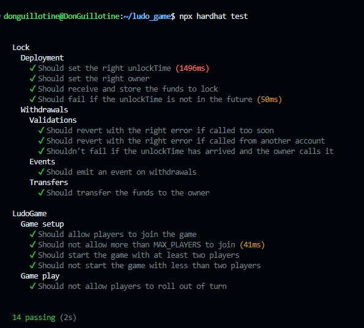

# LudoGame - A Blockchain-Based Ludo Game

LudoGame is a decentralized, blockchain-based version of the traditional board game Ludo. Built with Solidity in a Hardhat development environment, the contract implements all core mechanics of Ludo: player turns, dice rolls, token movement, and token capturing. The contract enforces the rules, manages game state and emits events for external clients to track gameplay.

## Features

- **Multiplayer**: Supports up to 4 players per game.
- **Turn-based Gameplay**: Enforces sequential turns between players.
- **Random Dice Rolls**: Uses Ethereum blockchain properties to generate pseudo-random dice rolls.
- **Token Movement and Capture**: Players move tokens according to dice rolls, and tokens can capture others, sending them back to start.
- **Win Condition**: Players must bring all 4 tokens "home" to win the game.
- **Event Emission**: Key events such as dice rolls, token movements, captures, and game completion are emitted for external monitoring.

## Smart Contract Overview

The contract, written in Solidity, models the basic mechanics of Ludo:

- Players join the game using the `joinGame` function.
- The game starts when at least two players have joined, and a player calls `startGame`.
- Players roll a dice using the `rollDice` function, determining the number of spaces they can move.
- Tokens are moved around the board using the `moveToken` function. A player needs to roll a 6 to move a token from the start. Tokens can capture others and send them back to the start.
- The first player to bring all their tokens home wins, ending the game.

The contract is equipped with several key events:

- **`GameStarted`**: Triggered when the game begins.
- **`DiceRolled`**: Emitted when a player rolls the dice.
- **`TokenMoved`**: Emitted when a token is moved on the board.
- **`TokenCaptured`**: Triggered when a player's token captures another player's token.
- **`PlayerWon`**: Emitted when a player wins the game by bringing all their tokens home.

## Prerequisites

Before setting up the project, ensure you have the following installed:

- **Node.js**: Download and install [Node.js](https://nodejs.org/).
- **Hardhat**: Hardhat is the development environment for Ethereum-based smart contracts. You can install it as a development dependency via npm.
- **MetaMask**: If you wish to interact with the deployed contract via a frontend, you'll need a MetaMask wallet.

## Getting Started

To get started with the project, follow these steps:

1. **Clone the repository**:
   ```bash
   git clone https://github.com/DonGuillotine/ludo-smart-contract.git
   cd ludo-smart-contract
   ```

2. **Install dependencies**:
   Ensure that you have Hardhat and other required packages installed:
   ```bash
   npm install
   ```

3. **Compile the smart contract**:
   Use Hardhat to compile the Solidity contract:
   ```bash
   npx hardhat compile
   ```

4. **Run tests**:
   The project contains test cases to verify the behavior of the smart contract. Run the tests to ensure everything works as expected:
   ```bash
   npx hardhat test
   ```

## Contract Deployment

The contract has not yet been deployed to any Ethereum network, but here is an example of how you can deploy it using Hardhat:

1. **Create a deployment script**: In the `scripts` folder, create a file called `deploy.js` with the following content:

   ```javascript
   async function main() {
       const LudoGame = await ethers.getContractFactory("LudoGame");
       const ludoGame = await LudoGame.deploy();
       await ludoGame.waitForDeployment();

       console.log("LudoGame deployed to:", await ludoGame.getAddress());
   }

   main()
   .then(() => process.exit(0))
   .catch((error) => {
       console.error(error);
       process.exit(1);
   });
   ```

2. **Deploy the contract**:
   To deploy the contract to a local blockchain, run:

   ```bash
   npx hardhat node
   npx hardhat run --network localhost scripts/deploy.js
   ```

   To deploy on a live network like Sepolia, make sure you have an Infura or Alchemy API key, and then deploy using:

   ```bash
   npx hardhat run --network sepolia scripts/deploy.js
   ```

## Testing

Unit tests are written using the Hardhat environment. To ensure the contract behaves as expected, run:

```bash
npx hardhat test
```

The tests cover:

- Player joining functionality.
- Game start conditions.
- Dice rolls and randomness.
- Token movements and capturing.
- Winning conditions and game termination.

# All tests passed



## Contract Functions

### Player Functions
- **`joinGame()`**: Allows a player to join the game, up to a maximum of 4 players.
- **`startGame()`**: Starts the game once at least 2 players have joined.
- **`rollDice()`**: Allows the current player to roll the dice.
- **`moveToken(uint8 tokenIndex, uint8 spaces)`**: Moves a player's token based on dice roll.

### View Functions
- **`getGameState()`**: Returns the current state of the game, including player addresses, token positions, home tokens, current player index, and game status.

## Events

- **`GameStarted()`**: Emitted when the game starts.
- **`DiceRolled(address player, uint8 roll)`**: Emitted when a player rolls the dice.
- **`TokenMoved(address player, uint8 tokenIndex, uint8 newPosition)`**: Emitted when a player's token moves.
- **`TokenCaptured(address capturer, address captured, uint8 position)`**: Emitted when a token captures another token.
- **`PlayerWon(address player)`**: Emitted when a player wins the game.

## Future Improvements

- **Frontend Integration**: Implement a frontend using React or other frameworks to interact with the contract.
- **Advanced Randomness**: Consider using Chainlink VRF for more secure randomness in dice rolls.
- **Gas Optimization**: Refactor parts of the contract to minimize gas costs.
- **Multi-game Support**: Extend the contract to support multiple simultaneous games.

## License

This project is licensed under the MIT License. See the [LICENSE](./LICENSE) file for details.
